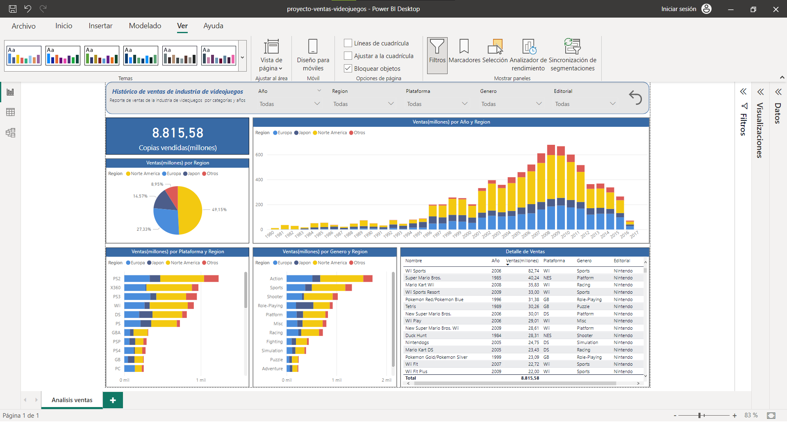

#  Proyecto 1 – Ventas Videojuegos

## 🎯 Objetivo
Analizar las **ventas históricas de videojuegos** para identificar patrones de comportamiento, productos más vendidos y tendencias por región o plataforma.

## 🗂️ Dataset
| Archivo | Ubicación | Descripción | 
|----------|------------|--------------|
| **VentasVideojuegos.xlsx** | [`datos/Ventas+Videojuegos.xlsx`](datos/Ventas+Videojuegos.xlsx) | Contiene las ventas históricas de videojuegos por título, género, plataforma, año y región.

## 🧩 Modelo de datos
Archivo: [`modelo/model.tmdl`](modelo/model.tmdl)     
Captura: [`capturas/modelo.png`](capturas/modelo.png)  

## 📈 Reporte
El dashboard se desarrolla en Power BI Project:  
**[`reporte/proyecto-ventas-videojuegos.pbip`](reporte/proyecto-ventas-videojuegos.pbip)**

### Páginas:
1. Analisis ventas 

📷 **Vista general del dashboard:**    

## ✅ Resultados
- Identificación de los **videojuegos más vendidos** .  
- Detección de **preferencias regionales** por plataforma y género.  
- Evolución de las ventas por año y participación por región