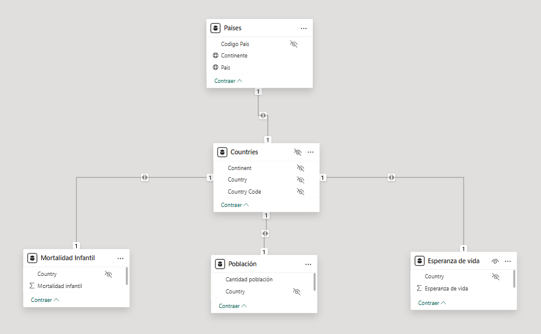
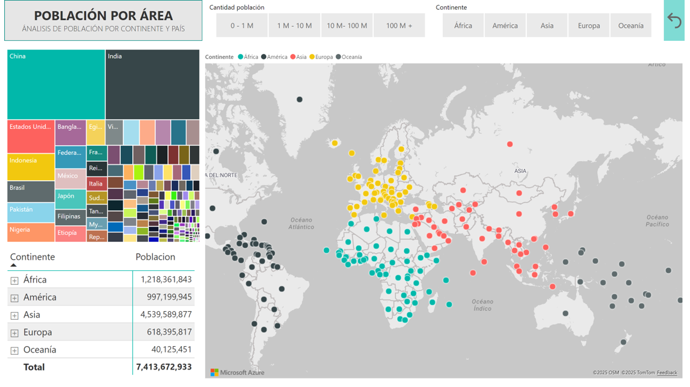
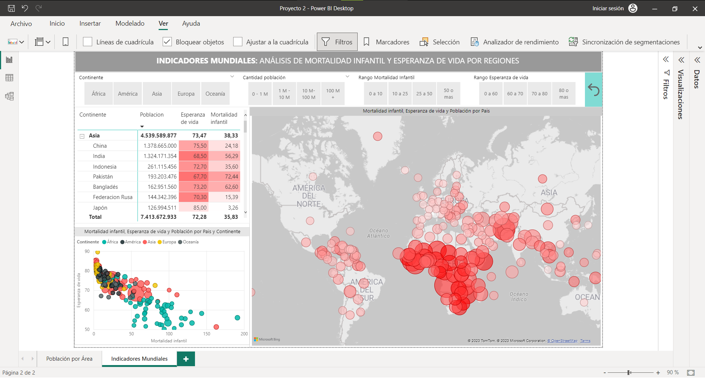

# Proyecto 2 – Indicadores Mundiales 🌍

## 🎯 Objetivo
Analizar indicadores globales de **población**, **esperanza de vida** y **mortalidad infantil** por país, para identificar relaciones entre ellos y visualizar las diferencias entre regiones y continentes.

---

## 🗂️ Estructura del proyecto

```
02-indicadores-mundiales/
│
├─ datos/              → Archivos Excel con las fuentes de datos
│   ├─ Countries.xlsx
│   ├─ Population.xlsx
│   ├─ Life+expectancy.xlsx
│   ├─ Infant+death+rate.xlsx
│   └─ Paises.xlsx
│
├─ modelo/             → Modelo tabular en formato TMDL
│   └─ modelo.tmdl
│
├─ reporte/            → Proyecto Power BI en formato PBIP
│   └─ IndicadoresMundiales.pbip
│
├─ capturas/           → Imágenes y GIF del dashboard
│   ├─ 01-poblacion-por-area.png
│   ├─ 02-indicadores-mundiales.png
│   └─ proyecto-indicadores-mundiales.gif
│
└─ README.md
```


---

## 🧾 Origen de datos

El modelo utiliza varias fuentes en formato Excel, todas almacenadas en la carpeta [`datos/`](datos/):

| Archivo | Descripción | Campos principales |
|----------|--------------|--------------------|
| **Countries.xlsx** | Lista de países con su código ISO y continente. | `Country`, `Country Code`, `Continent` |
| **Population.xlsx** | Población total por país. | `Country`,  `Population` |
| **Life expectancy.xlsx** | Esperanza de vida promedio al nacer por país. | `Country`, `Life Expectancy` |
| **Infant death rate.xlsx** | Tasa de mortalidad infantil por país. | `Country`,  `Infant mortality` |
| **Paises.xlsx** | Archivo auxiliar de mapeo entre nombres de país y contiente en español. | `Codigo Pais`, `Pais`, `Contiente` |

---

## 🧩 Modelo de datos

Archivo: [`modelo/modelo.tmdl`](modelo/modelo.tmdl)  

El modelo integra las tablas anteriores mediante el campo **Country**, estableciendo relaciones entre población, esperanza de vida y mortalidad infantil.



---

## 📈 Reporte

Proyecto Power BI: [`reporte/IndicadoresMundiales.pbip`](reporte/IndicadoresMundiales.pbip)

### Páginas
1. Población por Area 
2. Indicadores Mundiales  


## ✅ Resultados
- Se observa una **correlación negativa** entre la esperanza de vida y la mortalidad infantil.  
- Paneles interactivos que permiten comparar indicadores entre regiones y países.
