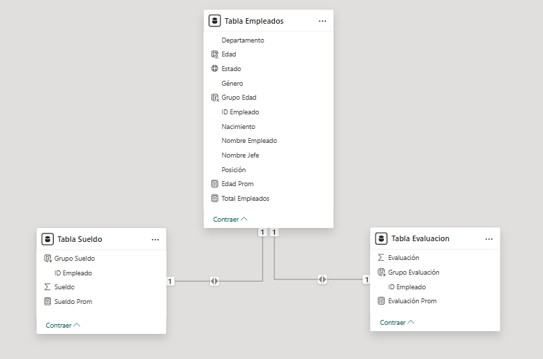
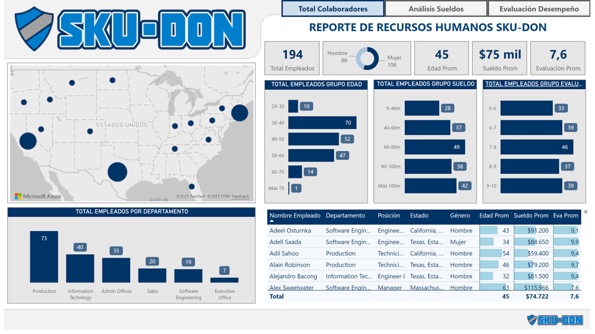
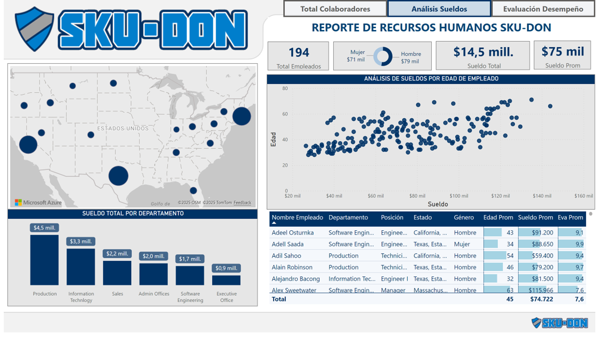
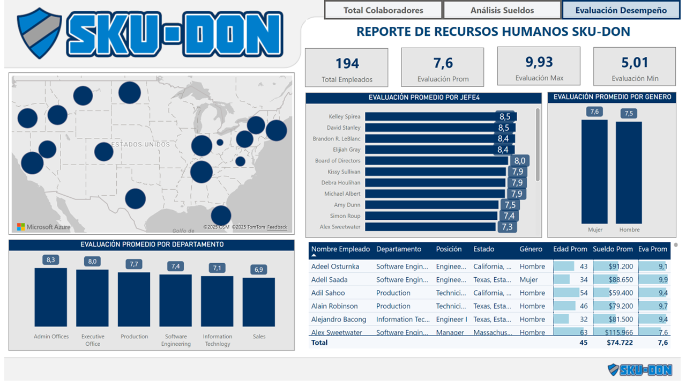

# Proyecto 3 – Indicadores de RRHH 👥

## 🎯 Objetivo
Analizar los principales indicadores de **Recursos Humanos**:
- **Headcount** (cantidad de empleados)
- **Sueldos** (promedio, total y distribución)
- **Edad promedio**
- **Desempeño** (promedio, máximos/mínimos, por jefe y por área)

---

## 🗂️ Estructura del proyecto

```
03-indicadores-rrhh/
│
├─ datos/
│   └─ Datos+Empleados.xlsx        → Archivos Excel con las fuentes de datos
│
├─ modelo/
│   └─ model.tmdl 
│
├─ reporte/
│   └─ indicadores-rrhh.pbip        → Proyecto Power BI en formato PBIP
│
├─ capturas/                         → Imágenes y GIF del dashboard
│   ├─ 01-reporte-colaboradores.png
│   ├─ 02-reporte-sueldos.png
│   ├─ 03-reporte-desempeño.png
│   ├─ indicadores-rrhh.gif
│   └─ modelo.png
│
└─ README.md
```

---

## 🧾 Origen de datos

Fuente única (Excel):
- **Archivo:** [`datos/Datos+Empleados.xlsx`](datos/Datos+Empleados.xlsx)  
- **Uso:** carga de la tabla *Tabla Empleados* (Power Query).  


---

## 🧩 Modelo de datos
 


### Relaciones (según `definition/relationships.tmdl`)
```
'Tabla Evaluacion'[ID Empleado]  →  'Tabla Empleados'[ID Empleado]  (bothDirections, fromCardinality: one)
'Tabla Sueldo'[ID Empleado]      →  'Tabla Empleados'[ID Empleado]  (bothDirections, fromCardinality: one)
```

---

## 📈 Reporte (Power BI)

- **Proyecto PBIP:** [`reporte/indicadores-rrhh.pbip`](reporte/indicadores-rrhh.pbip)

### Páginas 
1. **Colaboradores** — vista general del personal  
   
2. **Sueldos** — análisis de sueldos promedio/total y distribución  
   
3. **Desempeño** — promedio, top/bottom y cortes por jefe/área  
   


---

## ✅ Resultados esperados
- Visión integral de **headcount, sueldos y desempeño**.  
- Identificación de **brechas salariales** por área o género.  
- Detección de **jefes/departamentos** con mejor/peor desempeño promedio.  

---

