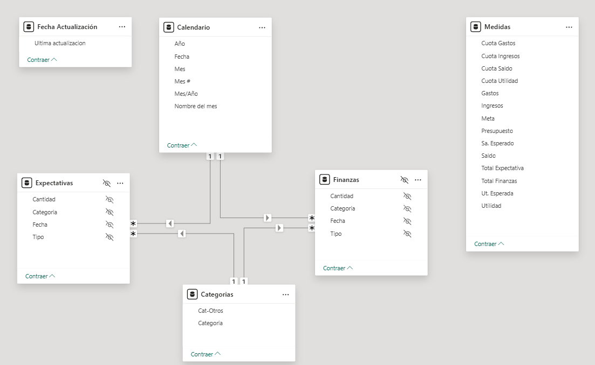
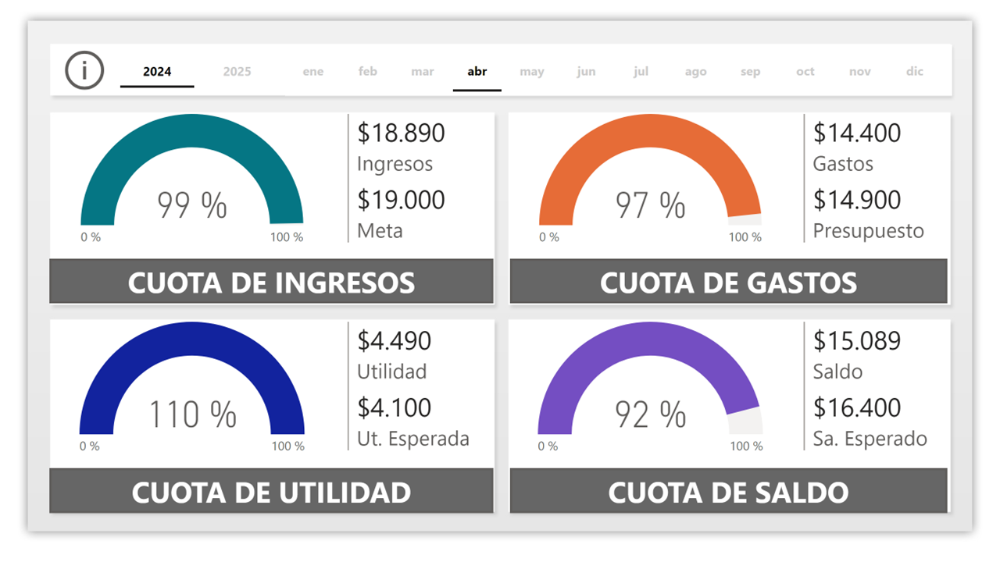
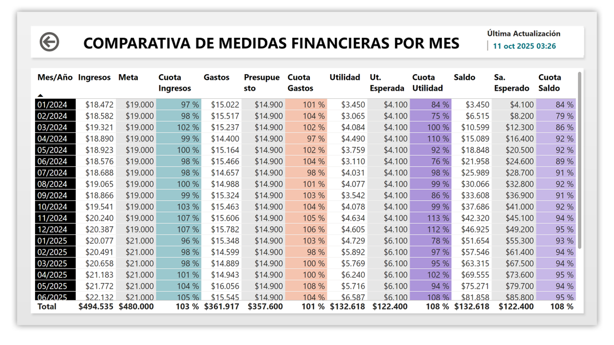

# Proyecto 4 – Finanzas Personales 💰

## 🎯 Objetivo
Desarrollar un tablero de **Finanzas Personales** en Power BI que permita:
- Registrar y analizar **ingresos, gastos y utilidad mensual**.  
- Comparar los valores reales frente a las **expectativas presupuestadas**.  
- Medir la **distribución porcentual** de cada tipo de ingreso y gasto.  
- Visualizar la **evolución temporal** y el **balance general** de las finanzas.

Este proyecto integra todos los conceptos vistos en el curso: limpieza y modelado de datos, creación de medidas DAX, relaciones entre tablas y diseño de reportes dinámicos e interactivos.

---

## 🗂️ Estructura del proyecto
```
04-finanzas-personales/
│
├─ datos/
│   ├─ Calendario2024.xlsx
│   ├─ Calendario2025.xlsx
│   ├─ Categorias.xlsx
│   └─ Finanzas.xlsx
│
├─ medidas/
│   └─ Medidas.tmdl
│
├─ modelo/
│   └─ model.tmdl
│
├─ reporte/
│   └─ proyecto-finanzas-personales.pbip
│   
├─ capturas/
│   ├─ 01-Principal.PNG
│   ├─ 02-Medidas.PNG
│   ├─ 03-Cuota Ingresos.PNG
│   ├─ 04-Detalles Ingresos.PNG
│   ├─ 05-Cuota Gastos.PNG
│   ├─ 06-Detalle Gastos.PNG
│   ├─ 07-Cuota Utilidad.PNG
│   ├─ 08-Detalles Utilidad.PNG
│   ├─ 09-Cuota Saldo.PNG
│   ├─ modelo.png
│   └─ proyecto-finanzas-personales.gif
│
└─ README.md
```


## 🧾 Orígenes de datos

| Archivo | Descripción |
|----------|--------------|
| **Calendario2024.xlsx** | Tabla de fechas para análisis de períodos del año 2024. |
| **Calendario2025.xlsx** | Continuación del calendario para ejercicios 2025. |
| **Categorias.xlsx** | Lista de categorías de ingresos y gastos. |
| **Finanzas.xlsx** | Registro de operaciones financieras (tipo, monto, categoría, fecha). |

📁 Todos los archivos están ubicados en la carpeta [`datos/`](datos/).

---

## 🧩 Modelo de datos 

🧭 **Vista del modelo:**  



### Tablas

| Tabla | Columnas | Descripción |
|--------|-----------|-------------|
| **Calendario** | `Mes #`, `Nombre del mes` | Base temporal para agrupar por mes y año. |
| **Categorias** | — | Define los tipos de ingresos y gastos. |
| **Expectativas** | — | Contiene los objetivos o presupuestos planificados. |
| **Fecha Actualización** | `Ultima actualizacion` | Fecha de la última actualización del modelo. |
| **Finanzas** | — | Tabla central con ingresos, gastos y saldos. |
| **JerarquiaFechas1–3** | — | Soporte para jerarquías de tiempo (año → mes → día). |
| **Medidas** | *(definida en `/medidas/Medidas.tmdl`)* | Tabla de medidas DAX agrupadas. |

---

## 🧮 Medidas DAX (según `medidas/Medidas.tmdl`)

| Medida | Descripción |
|--------|--------------|
| **Total Finanzas** | Monto total de todas las operaciones (ingresos + gastos). |
| **Total Expectativa** | Valor total presupuestado. |
| **Ut. Esperada** | Utilidad proyectada según expectativas. |
| **Cuota Ingresos** | Porcentaje de los ingresos sobre el total. |
| **Cuota Gastos** | Porcentaje de los gastos sobre el total. |
| **Cuota Utilidad** | Relación entre utilidad e ingresos. |
| **Cuota Saldo** | Balance porcentual entre ingresos y gastos. |

> 🧠 Las medidas se utilizan para analizar variaciones entre valores reales y esperados, tanto en términos absolutos como porcentuales.

---

## 🔗 Relaciones del modelo
(extraídas de `relationships.tmdl`)
```
'Finanzas'[Mes #]           →  'Calendario'[Mes #]
'Finanzas'[Categoría]       →  'Categorias'[Categoría]
'Expectativas'[Categoría]   →  'Categorias'[Categoría]
```

---

## 📊 Reporte (Power BI)
**Archivo:** [`reporte/proyecto-finanzas-personales.pbip`](reporte/proyecto-finanzas-personales.pbip)

### Páginas del dashboard
1. **Principal** — resumen general de ingresos, gastos y ahorro.  
   
2. **Medidas** — indicadores DAX utilizados.  
   
3. **Cuota de Ingresos** — distribución porcentual de los ingresos.  
   
4. **Detalle de Ingresos** — desglose por fuente y mes.  
   
5. **Cuota de Gastos** — proporción de gastos reales vs esperados.  
   
6. **Detalle de Gastos** — detalle mensual y por categoría.  
   
7. **Cuota de Utilidad** — porcentaje de utilidad neta.  
   
8. **Detalle de Utilidad** — detalle comparativo de utilidad.  
   
9. **Cuota de Saldo** — balance neto general.  
   

---

## ✅ Resultados esperados
- Control de **ingresos y gastos**.  
- Comparación de **valores reales vs presupuestados**.  
- Cálculo de **porcentajes de utilidad, saldo y gasto**.  
- Visualizaciones dinámicas y detalladas por categoría.

---