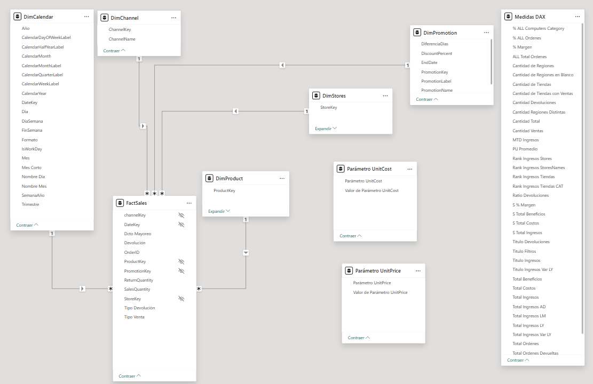
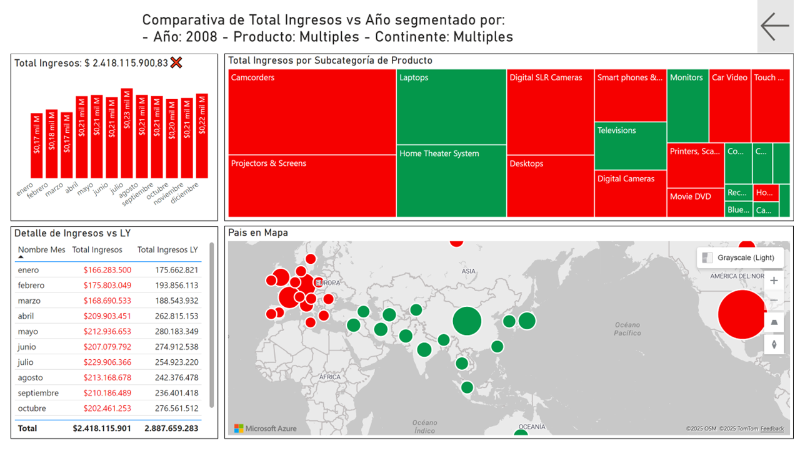
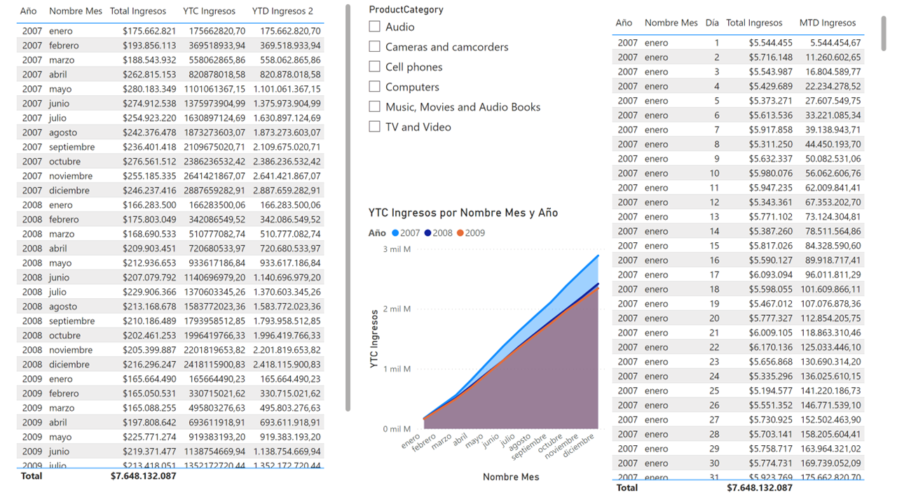
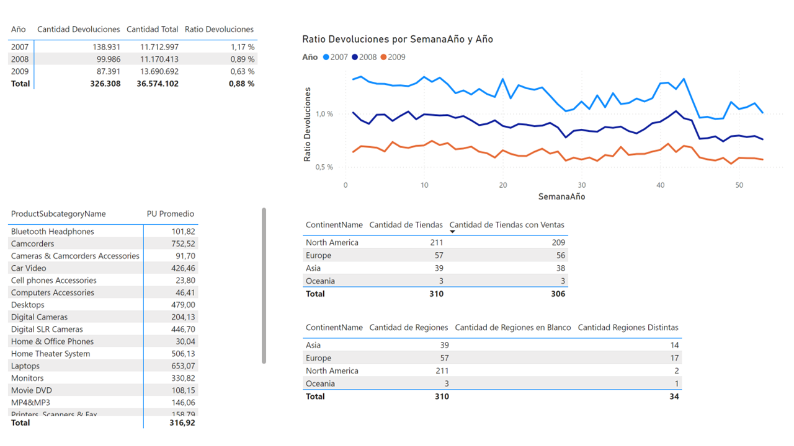
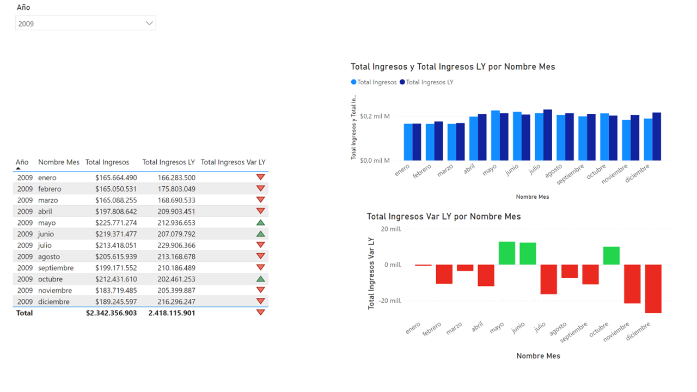
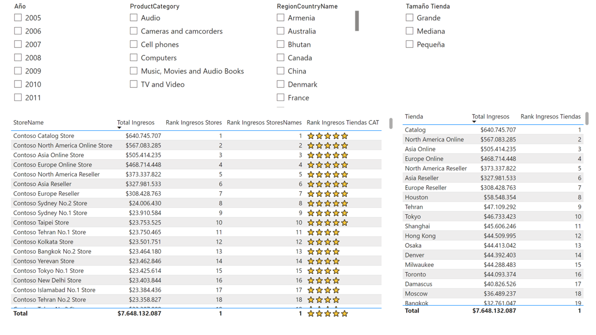
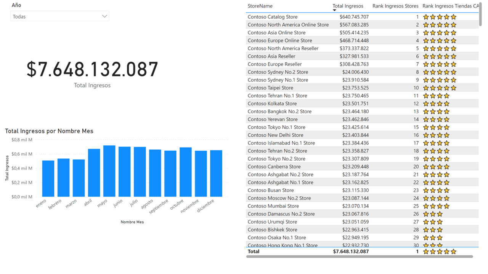
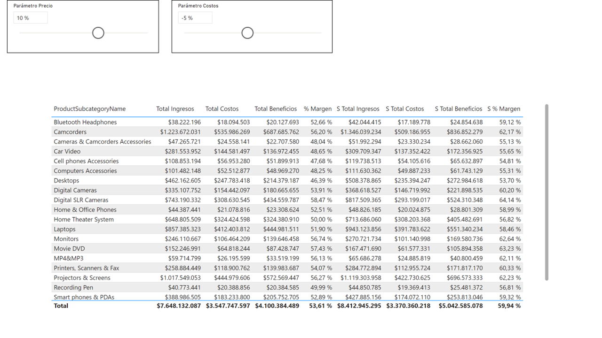

# Proyecto 5 – Prácticas con DAX 📐

## 🎯 Objetivo
Practicar y consolidar conocimiento en **DAX** con un modelo de ventas:  
- Medidas de agregación y KPIs.  
- Inteligencia de tiempo (YTD, LY, LM, variaciones).  
- Parámetros y análisis de sensibilidad (UnitPrice/UnitCost).  
- Tasas (% contribución, tasas de devolución, márgenes).  
- Rankings/TopN y comparativas segmentadas.
- Uso de **marcadores** para crear paneles interactivos y filtrados dinámicos.

> 🧠 En este proyecto el foco está puesto en la **práctica y aprendizaje de expresiones DAX**,  
> no en el **diseño visual del dashboard**. Aunque se explora una característica avanzada como es  
> la **creación de paneles interactivos** mediante marcadores y botones de acción.

---

## 🗂️ Estructura del proyecto 

```
05-proyecto_dax/
│
├─ datos/
│   ├─ DimCalendar.xlsx
│   ├─ DimChannel.xlsx
│   ├─ DimGeography.xlsx
│   ├─ DimProduct.xlsx
│   ├─ DimProductCategory.xlsx
│   ├─ DimProductSubcategory.xlsx
│   ├─ DimPromotion.xlsx
│   └─ DimStores.xlsx
│
├─ reporte/
│   └─ proyecto-DAX.pbip
│
├─ capturas/
│   ├─ modelo.png
│   ├─ 01-comparativa-segmentada.PNG
│   ├─ 02-comparativa-anual.PNG
│   ├─ 03-analisis-devoluciones.PNG
│   ├─ 04-variacion-anual.PNG
│   ├─ 05-ytd-ly-lm.PNG
│   ├─ 06-rank-topn.PNG
│   ├─ 07-parametros-unitprice-cost.PNG
│   ├─ 08-contribucion-categorias.PNG
│   └─ 09-margenes-utilidad.PNG
│
└─ README.md
```


## 🧾 Orígenes de datos
Ubicación: [`datos/`](datos/)  
- **DimCalendar.xlsx**, **DimChannel.xlsx**, **DimGeography.xlsx**, **DimProduct.xlsx**, **DimProductCategory.xlsx**, **DimProductSubcategory.xlsx**, **DimPromotion.xlsx**, **DimStores.xlsx**  
Estas tablas conforman las **dimensiones** del modelo de ventas (tiempo, producto, geografía, canal, tienda, promoción).

---

## 🧩 Modelo de datos 
🧭 **Vista del modelo de datos:**  



- **Relaciones y medidas DAX:** definidas en el modelo semántico vinculado al archivo `.pbip`.  
- **Expresiones y parámetros:** configurados para escenarios de sensibilidad (UnitPrice y UnitCost).  


> 🔄 Durante el modelado se realizaron **tareas de desnormalización** para convertir un modelo **copo de nieve (snowflake)** en un **modelo estrella (star schema)**, reduciendo la cantidad de relaciones indirectas y mejorando la eficiencia de las consultas DAX.


---

## 🧮 Medidas DAX (resumen)

- **Ingresos / Ventas Netas / Total Ingresos**  
  Sumas básicas (`SUMX`, `CALCULATE`) y netas de devoluciones.  
- **Var LY / LM / AD / YTD / YTC**  
  Variaciones con `TOTALYTD`, `DATEADD`, `PARALLELPERIOD`.  
- **Tasa Devoluciones / Margen / Margen %**  
  Cálculos con `DIVIDE` y `SUMX` sobre ingresos y costos.  
- **Ranking / TopN / % Contribución**  
  `RANKX`, `TOPN`, `ALLSELECTED` y `DIVIDE`.  
- **Títulos dinámicos**  
  Usan `SELECTEDVALUE` y concatenación para contexto dinámico.  

---
## Reporte
**Archivo PBIP:** [`reporte/proyecto-DAX.pbip`](reporte/proyecto-DAX.pbip)  

### 📊 Páginas del Dashboard (resumen)

1. **Comparativa segmentada**  
     
   Análisis de ingresos y utilidades por segmento, canal y región.  
   Utiliza medidas DAX basadas en `CALCULATE`, `ALLSELECTED` y porcentajes de contribución para comparar participación entre categorías.

2. **Comparativa anual**  
     
   Comparativa de resultados anuales e interanuales.  
   Incluye medidas con `TOTALYTD`, `DATEADD` y variaciones relativas (`Var % LY`, `Var % LM`) para mostrar tendencias por año.

3. **Análisis de devoluciones**  
     
   Análisis de devoluciones de ventas y su impacto en los ingresos netos.  
   Calcula tasas de devolución (`Tasa Devoluciones`) y montos netos (`Ventas Netas`) mediante expresiones `DIVIDE` y `CALCULATE`.

4. **Variación anual**  
     
   Panel de variación anual de ingresos y costos.  
   Visualiza el desempeño actual respecto a periodos previos con medidas DAX que combinan `VAR`, `CALCULATE` y `DATEADD`.

5. **Indicadores YTD / LY / LM**  
     
   Consolidado temporal que resume indicadores **YTD**, **LY** y **LM**.  
   Emplea funciones de inteligencia de tiempo (`TOTALYTD`, `SAMEPERIODLASTYEAR`) y comparativas (`Var % YTD`).

6. **Ranking y TopN**  
     
   Ranking dinámico de productos o categorías más destacadas.  
   Usa `RANKX`, `TOPN`, `ALLSELECTED` para ordenar valores de ingreso o utilidad y controlar la cantidad de elementos visibles.

7. **Parámetros de UnitPrice y UnitCost**  
     
   Escenario de análisis de sensibilidad con parámetros de precio y costo unitario.  
   Los parámetros (`Parámetro UnitPrice` y `Parámetro UnitCost`) permiten simular distintos márgenes mediante `SELECTEDVALUE` y `SWITCH`.

---
### 🎚️ Interactividad adicional: marcadores y panel de filtros (**Pagina 1 - Comparativa segmentada** )

Se implementaron **marcadores (bookmarks)** y **botones de acción**  para permitir al usuario:  
- **Expandir o colapsar el panel de filtros** lateral en cada página.  
- Conservar el estado visual de las selecciones al navegar entre vistas.  
- Mejorar la experiencia de exploración sin saturar el espacio principal del dashboard.

Los marcadores fueron configurados para registrar la **visibilidad de objetos**, sin afectar los filtros activos,  
garantizando una navegación fluida y sin pérdida de contexto analítico.

---

## ✅ Resultados de aprendizaje
- Comprensión práctica del **contexto de filtro** y **transición de contexto**.  
- Implementación de **inteligencia de tiempo** (YTD, LY, LM, AD, Var%).  
- **Parámetros DAX** para análisis de sensibilidad.  
- Construcción de **TopN/Ranking** y composición porcentual.  
- **Desnormalización de modelo** para optimizar el rendimiento DAX.  
- Creación de **tooltips** y títulos dinámicos vinculados a contexto.
- Diseño de **experiencia de usuario limpia** mediante **colapsado y expansión de filtros** con bookmarks.

---
